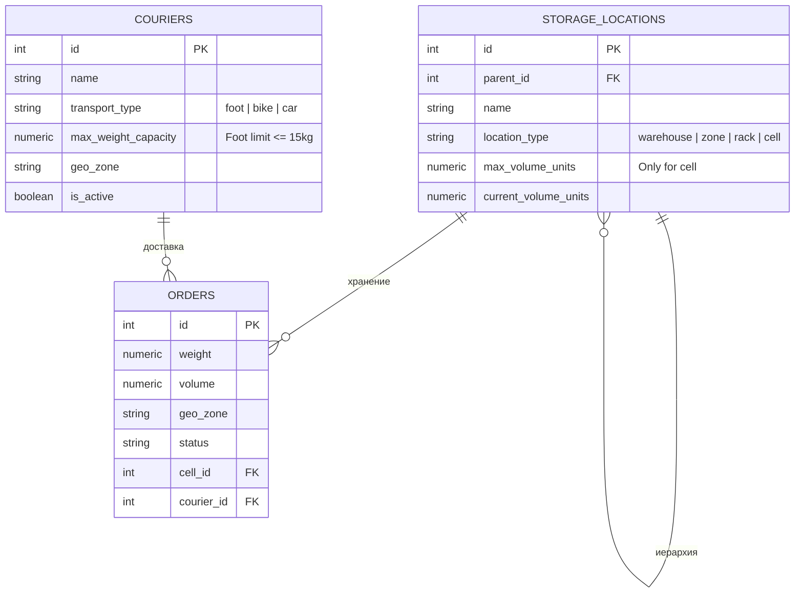
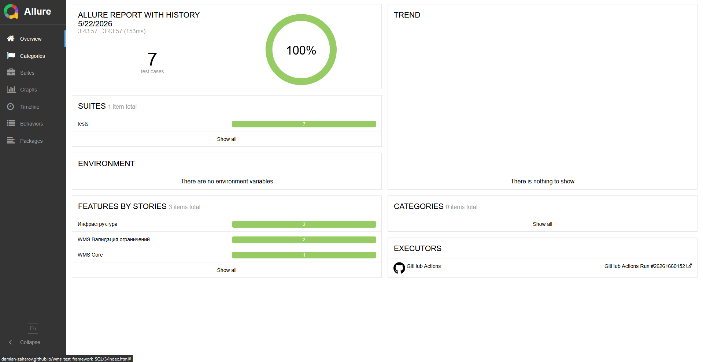
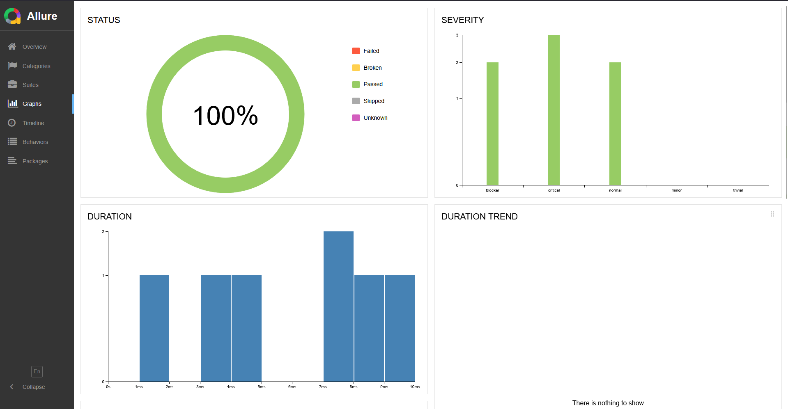
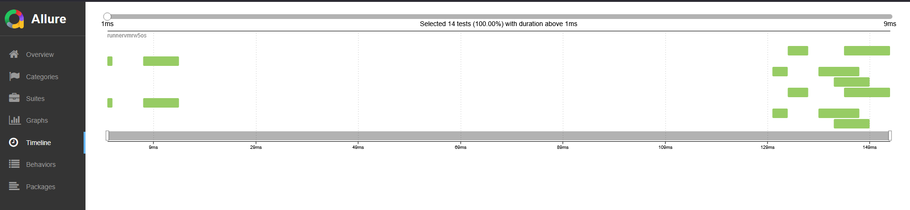
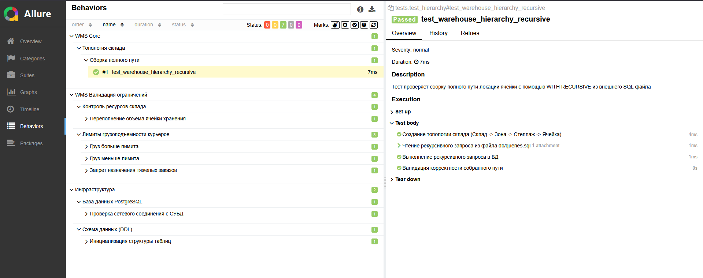

#  WMS SQL Test Framework


[](https://damian-zaharov.github.io/wms_test_framework_SQL/)
---

Инфраструктурно-ориентированный фреймворк на Python (`pytest` + `psycopg3`) для автоматизированного тестирования сложной бизнес-логики, ограничений и триггеров на уровне базы данных PostgreSQL в системах управления складом (WMS / логистические хабы распределения заказов).

Проект эмулирует бэкенд-логику сервисов, где критически важно валидировать целостность данных прямо на стороне СУБД.

---

## ⚡ Ключевые особенности

- Параллельное создание изолированных PostgreSQL БД для каждого pytest-xdist воркера
- Полный rollback транзакций после каждого теста
- Проверка рекурсивной иерархии склада через `WITH RECURSIVE`
- Тестирование триггеров, CHECK-constraint и бизнес-валидаций
- Полностью Dockerized-окружение для локального и CI запуска
- Интерактивная Allure-отчетность с автоматическим деплоем через GitHub Pages
---

## Тест-кейсы

Все тесты структурированы по критичности (**Severity**) и бизнес-контексту (**Allure Epic / Feature / Story**):

### 1. WMS Валидация ограничений 
`test_constraints.py` & `test_overflow.py`
* 🟩 **Груз меньше лимита** (**Severity: Normal*) — проверка корректной работы фабрики `Faker` при создании валидного пешего курьера (до 15 кг).
* 🟧 **Груз больше лимита** (*Severity: Critical*) — проверка работы `CHECK-constraint` на физический запрет создания пешего курьера с грузоподъемностью выше нормы.
* 🟧 **Запрет назначения тяжелых заказов** (*Severity: Critical*) — тестирование триггера `BEFORE INSERT OR UPDATE`, который блокирует назначение заказа весом 50 кг на курьера-пешехода.
* 🟧 **Переполнение объема ячейки хранения** (*Severity: Critical*) — тест на граничные состояния (Boundary Conditions). Эмулирует заполнение ячейки склада товарами до лимита объемных единиц и проверяет генерацию СУБД кастомного исключения `CellVolumeOverflow`.

### 2. WMS Core (Ядро системы) 
`test_hierarchy.py`
* 🟩 **Сборка полного пути** (*Severity: Normal*) — тестирование сложной топологии склада (`Склад -> Зона -> Стеллаж -> Ячейка`). Тест загружает из внешнего файла `queries.sql` рекурсивный запрос `WITH RECURSIVE` для обхода дерева локаций снизу вверх и проверяет правильность сборки адреса для сборщика заказов.

### 3. Инфраструктурные тесты 
`test_connection.py` & `test_schema.py`
* 🟩 **Сетевое соединение и структура таблиц** (*Severity: Blocker*) — базовые тесты на доступность СУБД и накатывание схемы данных (DDL).

---

## Особенности реализации

* **Параллелизация и полная изоляция БД (`pytest-xdist`)**: При параллельном запуске тесты баз данных часто вызывают состояние гонки (Race Condition). В данном фреймворке фикстура в `conftest.py` динамически перехватывает ID воркера и создает на лету изолированную временную БД (`wms_test_db_gw0`, `wms_test_db_gw1`...) для каждого потока, раскатывая туда схемы и триггеры индивидуально.
* **Изоляция транзакций**: После каждого отдельного теста фикстура выполняет `conn.rollback()`, гарантируя идеальную чистоту базы для следующего тест-кейса.
* **Именованные параметры в SQL**: В рекурсивных запросах используются безопасные плейсхолдеры шаблонов Python-драйвера `%(cell_id)s`, что защищает систему от SQL-инъекций и корректно валидируется линтером PyCharm.
* **Автоматизация CI/CD**: Настроен пайплайн GitHub Actions, который при каждом пуше поднимает PostgreSQL в Docker-сервисах, запускает тесты в параллельном режиме (`-n auto`), собирает историю запусков и деплоит статический отчет на GitHub Pages.

---

## Стек технологий

* **Python 3.12**
* **PostgreSQL 16** (в Docker-контейнере)
* **pytest** & **pytest-xdist** (тестовый движок и многопоточность)
* **psycopg3 (`psycopg_pool`)** (современный драйвер с пулом соединений)
* **Faker** (генерация согласованных бизнес-данных)
* **Allure-pytest** (интерактивная отчетность)

---
## 📦 Архитектура базы данных


---
## 🗂️ Структура проекта

```text
    wms_test_framework_SQL/
    │
    ├── .github/workflows/          # Конфигурация CI/CD пайплайна (GitHub Actions)
    │   └── ci.yml
    │
    ├── db/                         # Логика и миграции базы данных
    │   ├── schema.sql              # Схема таблиц, типы данных и CHECK-ограничения
    │   ├── triggers.sql            # PL/pgSQL функции и триггеры (бизнес-валидация)
    │   └── queries.sql             # Рекурсивный WITH RECURSIVE запрос с плейсхолдерами %(cell_id)s
    │
    ├── tests/                      # Набор автоматизированных тестов
    │   ├── conftest.py             # Фикстуры инициализации пула, изоляции БД и воркеров xdist
    │   ├── test_connection.py      # Проверка сетевого линка
    │   ├── test_schema.py          # Проверка накатывания таблиц
    │   ├── test_constraints.py     # Тесты ограничений веса и триггера курьеров
    │   ├── test_overflow.py        # Тест на переполнение ячеек
    │   └── test_hierarchy.py       # Тест чтения и сборки иерархии склада
    │
    ├── utils/                      # Фабрики тестовых данных
    │   └── data_generator.py       # WMSDataGenerator на базе Faker
    │
    ├── pytest.ini                  # Главный файл конфигурации pytest параметров запуска
    └── requirements.txt            # Зависимости проекта
```

---

## Как запустить проект локально

1. **Клонируйте репозиторий**:
   ```bash
   git clone https://github.com
   cd wms_test_framework_SQL
   ```

2. **Разверните изолированную базу данных в Docker**:
   ```bash
   docker-compose up -d
   ```

3. **Установите виртуальное окружение и зависимости**:
   ```bash
   python -m venv .venv
   source .venv/bin/activate  # Для Windows: .venv\Scripts\activate
   pip install -r requirements.txt
   ```

4. **Запустите тестоввую сессию (в 3 параллельных потока)**:
   ```bash
   pytest -n 3 --alluredir=allure-results --clean-alluredir
   ```

5. **Сгенерируйте и откройте локальный Allure-отчет**:
   ```bash
   allure serve allure-results
   ```
---
## Скриншоты
### Overview

### Graphs

### Timeline

### Behaviors
